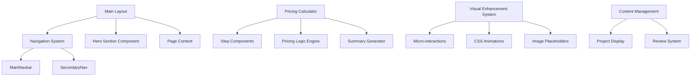

# Design Document: Website Enhancement

## Overview

This design document outlines the technical approach for enhancing the Welwitschia Data website with improved navigation, a comprehensive pricing calculator, visual enhancements, and content management improvements. The solution will be built using Next.js with TypeScript, maintaining the existing architecture while adding new interactive components and visual improvements.

## Architecture

The enhancement will follow a modular component-based architecture:



## Components and Interfaces

### Navigation System Updates

**MainNavbar Component Updates:**
- Update service menu items to reflect new naming conventions
- Remove deprecated service categories
- Maintain existing responsive behavior

**SecondaryNav Component Updates:**
- Update dropdown menus for data services and creative services
- Remove cybersecurity and virtual assistant options
- Update social media to "Social Media Management"

### Pricing Calculator System

**PricingCalculator Component:**
```typescript
interface PricingCalculatorProps {
  onComplete: (summary: PricingSummary) => void;
}

interface PricingSummary {
  clientType: 'SME' | 'Enterprise';
  selectedPackage?: PackageType;
  services: SelectedService[];
  monthlyServices: MonthlyService[];
  oneTimeCost: number;
  monthlyCost: number;
  enterpriseMultiplier: number;
}
```

**Step Components:**
1. **ClientTypeStep** - SME vs Enterprise selection
2. **PackageSelectionStep** - Starter/Growth/Enterprise/Custom packages
3. **ServiceSelectionStep** - Individual service checkboxes
4. **MonthlyServicesStep** - Hosting and maintenance selection
5. **SummaryStep** - Final pricing display and export

**Pricing Logic Engine:**
```typescript
class PricingEngine {
  private static readonly SERVICE_PRICES = {
    webDesign: { basic: 10000, standard: 20000, advanced: 35000 },
    webApp: { simple: 50000, medium: 85000, complex: 150000 },
    dashboard: { basic: 15000, advanced: 35000, executive: 60000 },
    // ... other services
  };
  
  private static readonly MONTHLY_PRICES = {
    hosting: { basic: 450, advanced: 1000 },
    maintenance: { basic: 1200, full: 2500 },
    retainers: {
      analytics: 5000,
      dataScience: 10000,
      dataEngineering: 8000,
      virtualAssistant: 8000,
      socialMedia: 6000
    }
  };
  
  calculateTotal(selections: ServiceSelections): PricingSummary;
  applyEnterpriseMultiplier(cost: number): number;
}
```

### Hero Section System

**HeroSection Component:**
```typescript
interface HeroSectionProps {
  title: string;
  subtitle: string;
  backgroundImage?: string;
  imagePlaceholder?: ImagePlaceholder;
  ctaButton?: CTAButton;
  variant: 'primary' | 'secondary' | 'minimal';
}

interface ImagePlaceholder {
  description: string;
  suggestedType: string;
  aspectRatio: string;
  size: 'small' | 'medium' | 'large';
}
```

**Page-Specific Hero Configurations:**
- Homepage: Company overview with team/office imagery
- Pricing: Calculator preview with cost transparency theme
- Services: Service-specific imagery and value propositions
- About: Team and company culture imagery

### Visual Enhancement System

**Micro-interactions Framework:**
```typescript
interface MicroInteraction {
  trigger: 'hover' | 'click' | 'scroll' | 'focus';
  animation: AnimationType;
  duration: number;
  easing: string;
}

enum AnimationType {
  FADE_IN = 'fadeIn',
  SLIDE_UP = 'slideUp',
  SCALE = 'scale',
  BOUNCE = 'bounce',
  GLOW = 'glow'
}
```

**CSS Animation Classes:**
- `.animate-fade-in` - Smooth element appearance
- `.animate-slide-up` - Content reveal animations
- `.animate-scale-hover` - Interactive element scaling
- `.animate-glow` - Subtle highlight effects
- `.animate-bounce-gentle` - Attention-drawing animations

## Data Models

### Pricing Data Structure

```typescript
interface ServiceCategory {
  id: string;
  name: string;
  services: Service[];
}

interface Service {
  id: string;
  name: string;
  description: string;
  pricing: ServicePricing;
  category: string;
  isMonthly: boolean;
}

interface ServicePricing {
  base: number;
  tiers?: { [key: string]: number };
  enterpriseMultiplier?: number;
}

interface Package {
  id: string;
  name: string;
  description: string;
  targetAudience: string;
  includedServices: string[];
  priceRange: {
    oneTime: { min: number; max: number };
    monthly: { min: number; max: number };
  };
}
```

### Project Data Structure

```typescript
interface Project {
  id: string;
  title: string;
  description: string;
  category: string;
  completionDate: Date;
  images: ProjectImage[];
  technologies: string[];
  clientName?: string;
  featured: boolean;
}

interface ProjectImage {
  url: string;
  alt: string;
  placeholder?: ImagePlaceholder;
}
```

## Correctness Properties

*A property is a characteristic or behavior that should hold true across all valid executions of a system—essentially, a formal statement about what the system should do. Properties serve as the bridge between human-readable specifications and machine-verifiable correctness guarantees.*

### Property Reflection

After analyzing the acceptance criteria, several properties can be consolidated to eliminate redundancy:

- Properties 2.2 and 6.4 both test enterprise pricing multiplier application - these can be combined
- Properties 3.1 and 3.2 both test hero section image handling - these can be combined  
- Properties 7.2 and 7.4 both test placeholder image handling - these can be combined
- Multiple pricing validation properties (6.1, 6.2, 6.3, 6.5) can be combined into a comprehensive pricing accuracy property

### Core Properties

Property 1: Enterprise pricing multiplier consistency
*For any* combination of one-time services selected in the pricing calculator, when Enterprise client type is chosen, all one-time costs should be increased by exactly 20% while monthly costs remain unchanged
**Validates: Requirements 2.2, 6.4**

Property 2: Package pre-filling with customization
*For any* package selection (Starter, Growth, or Enterprise), the pricing calculator should pre-populate the appropriate services while maintaining the ability to modify those selections and recalculate pricing accurately
**Validates: Requirements 2.3, 8.5**

Property 3: Cost separation consistency
*For any* combination of services selected in the pricing calculator, the final summary should always clearly separate one-time project costs from monthly recurring costs with no overlap between categories
**Validates: Requirements 2.4**

Property 4: Hero section universality
*For any* page on the website, a hero section should be present with appropriate content placeholders and image containers that maintain proper aspect ratios and sizing
**Validates: Requirements 3.1, 3.2**

Property 5: Performance preservation
*For any* page with visual enhancements, the page load time should remain under 3 seconds on standard connections despite the addition of micro-interactions and CSS animations
**Validates: Requirements 4.4**

Property 6: Project sorting consistency
*For any* collection of projects with completion dates, the recent work display should sort them from newest to oldest based on the completion date
**Validates: Requirements 5.2**

Property 7: Homepage project synchronization
*For any* new project added to the website design page, the homepage recent work section should automatically reflect this addition in the correct chronological position
**Validates: Requirements 5.4**

Property 8: Pricing accuracy across all services
*For any* service selection in the pricing calculator, the calculated costs should match the exact predefined pricing values for each service type and tier
**Validates: Requirements 6.1, 6.2, 6.3, 6.5**

Property 9: Image placeholder consistency
*For any* image placeholder implemented across the website, it should maintain proper aspect ratios, include descriptive suggestions, and allow seamless replacement without layout disruption
**Validates: Requirements 7.2, 7.4**

<function_calls>
<invoke name="prework">
<parameter name="featureName">website-enhancement

## Error Handling

### Pricing Calculator Error Handling

**Input Validation:**
- Validate all numeric inputs for pricing calculations
- Ensure required fields (client type, hosting selection) are completed
- Provide clear error messages for invalid selections

**Calculation Errors:**
- Handle edge cases where service combinations might cause calculation issues
- Implement fallback pricing when specific service tiers are unavailable
- Validate that enterprise multiplier doesn't cause integer overflow

**Export/Email Functionality:**
- Handle network failures gracefully when sending email summaries
- Provide offline PDF generation as fallback
- Validate email addresses before attempting to send

### Content Management Error Handling

**Project Display:**
- Handle missing project images with appropriate placeholders
- Gracefully handle projects without completion dates
- Provide fallback content when project data is unavailable

**Navigation Updates:**
- Ensure navigation remains functional if menu data is corrupted
- Provide fallback menu structure for critical navigation paths
- Handle responsive navigation gracefully across all device sizes

### Visual Enhancement Error Handling

**Animation Failures:**
- Provide fallback static states when CSS animations fail
- Ensure core functionality works without JavaScript enhancements
- Handle reduced motion preferences for accessibility

**Image Loading:**
- Implement progressive image loading with appropriate placeholders
- Handle broken image links gracefully
- Provide alt text for all images and placeholders

## Testing Strategy

### Dual Testing Approach

This project will implement both unit testing and property-based testing to ensure comprehensive coverage:

**Unit Tests:**
- Test specific examples and edge cases for pricing calculations
- Verify navigation menu updates display correct content
- Test individual component rendering and behavior
- Validate specific package configurations and pricing ranges
- Test error conditions and boundary cases

**Property-Based Tests:**
- Verify universal properties across all input combinations
- Test pricing calculations with randomized service selections
- Validate hero section consistency across all pages
- Test image placeholder behavior with various content types
- Verify performance characteristics under different load conditions

### Property-Based Testing Configuration

**Testing Framework:** We will use `fast-check` for TypeScript property-based testing, configured to run a minimum of 100 iterations per property test.

**Test Tagging:** Each property test will be tagged with a comment referencing its design document property:
- Format: `**Feature: website-enhancement, Property {number}: {property_text}**`

**Property Test Implementation:**
- Property 1: Generate random service combinations and verify enterprise multiplier
- Property 2: Test all package types with various customization scenarios  
- Property 3: Verify cost separation across all possible service selections
- Property 4: Test hero section presence and structure across all pages
- Property 5: Performance testing with various enhancement combinations
- Property 6: Test project sorting with randomized date collections
- Property 7: Test homepage updates with various project addition scenarios
- Property 8: Comprehensive pricing validation across all service combinations
- Property 9: Test placeholder behavior with various image scenarios

### Integration Testing

**End-to-End Pricing Flow:**
- Test complete pricing calculator workflow from start to finish
- Verify export functionality works correctly
- Test responsive behavior across different devices

**Navigation Integration:**
- Test updated navigation across all pages
- Verify menu interactions work correctly
- Test mobile navigation behavior

**Content Management Integration:**
- Test project display updates when content changes
- Verify hero section integration across all pages
- Test image placeholder replacement workflow

### Performance Testing

**Load Time Validation:**
- Measure page load times before and after enhancements
- Ensure visual improvements don't significantly impact performance
- Test on various network conditions and device types

**Animation Performance:**
- Verify micro-interactions don't cause frame drops
- Test CSS animation performance across different browsers
- Validate smooth transitions in pricing calculator steps

This comprehensive testing strategy ensures that both specific functionality and universal properties are validated, providing confidence in the system's correctness and reliability.